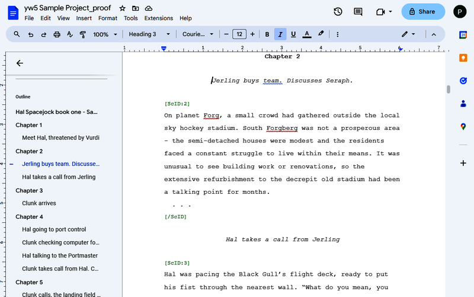

# ProofYw7 - Proofread yw7 scenes with ODT documents

Export a yw7 project to an OpenDocument file with scene markers. Write back the proofread scenes to the yw7 project file.

This is for editing yw7 manuscripts with a word processor that can read and write *.odt* documents, such as *Google Docs*.

**Note:** If you are a *LibreOffice* or *OpenOffice* user, you may prefer the [yw-cnv extension](https://peter88213.github.io/yw-cnv),
or the [pywoo extension](https://peter88213.github.io/pywoo). There is also [yW2OO](https://peter88213.github.io/yW2OO), a standalone converter providing much more features. 

## Features

- Launch the **proofyw7.pyw** Python script via drag/drop, the command line, or a batch file.
- When applied to a yw7 file, an *.odt* document with visible chapter markers and navigable headings is created.
- When applied to the edited *.odt* document, the yw7 file in the same folder is updated.
- Text markup: Bold and italics are supported. Other highlighting such as underline and strikethrough are lost.
- When editing the document, you can create new chapters and scenes by splitting existing scenes.
- Existing chapters and scenes can neither be rearranged nor deleted. 

## Requirements

- [Python](https://www.python.org/) version 3.6+.

## Download and install

[Download the latest release (version 3.1.1)](https://raw.githubusercontent.com/peter88213/ProofYw7/main/dist/proofyw7_v3.1.1.zip)

- Unzip the downloaded zipfile "proofyw7_v3.1.1.zip" within your user profile.
- Move into the unzipped folder and create a shortcut on the desktop.
- Open "README.md" for usage instructions.

### Note for Linux users

Please make sure that your Python3 installation has the *tkinter* module. On Ubuntu, for example, it is not available out of the box and must be installed via a separate package. 

------------------------------------------------------------------

[Changelog](changelog)

## Usage

See the [instructions for use](usage)

## Credits

- Frederik Lundh published the [xml pretty print algorithm](http://effbot.org/zone/element-lib.htm#prettyprint).

## License

ProofYw7 is distributed under the [MIT License](http://www.opensource.org/licenses/mit-license.php).
